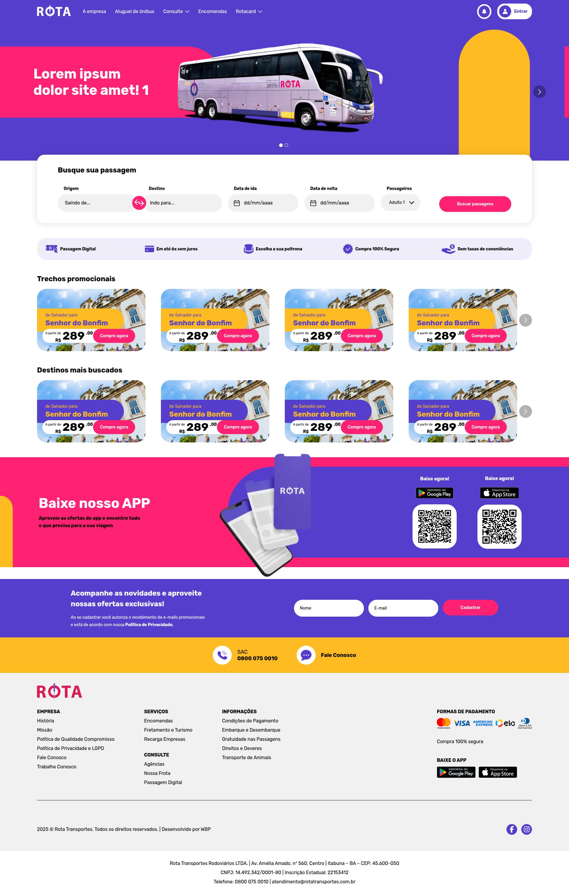
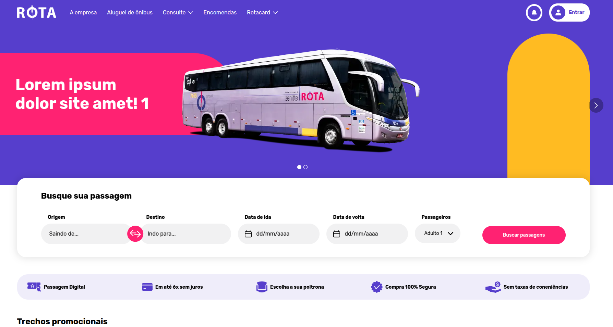
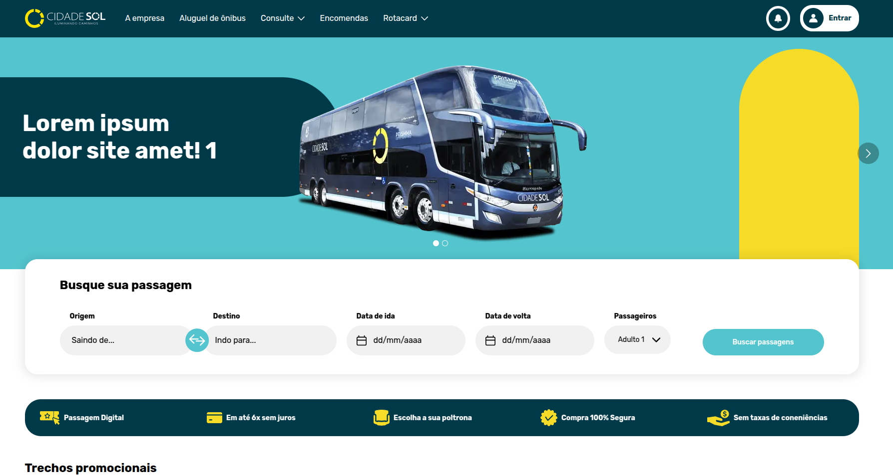
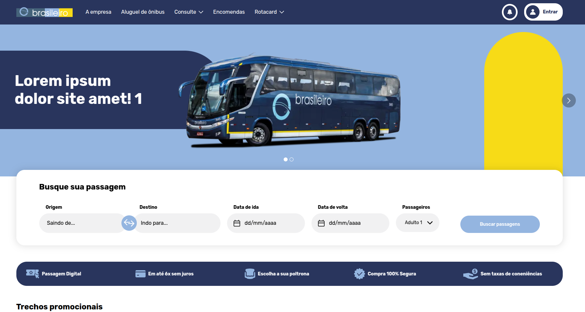
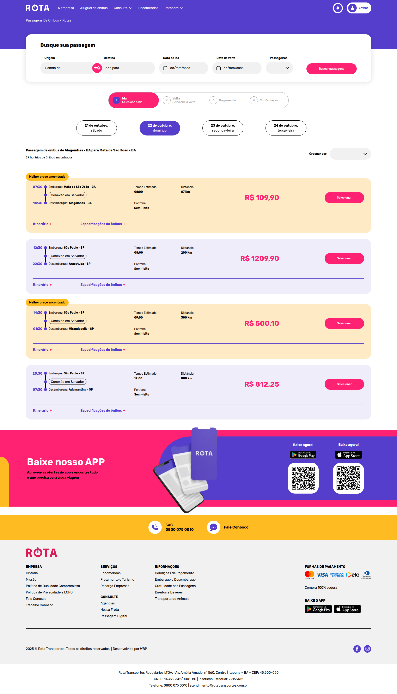
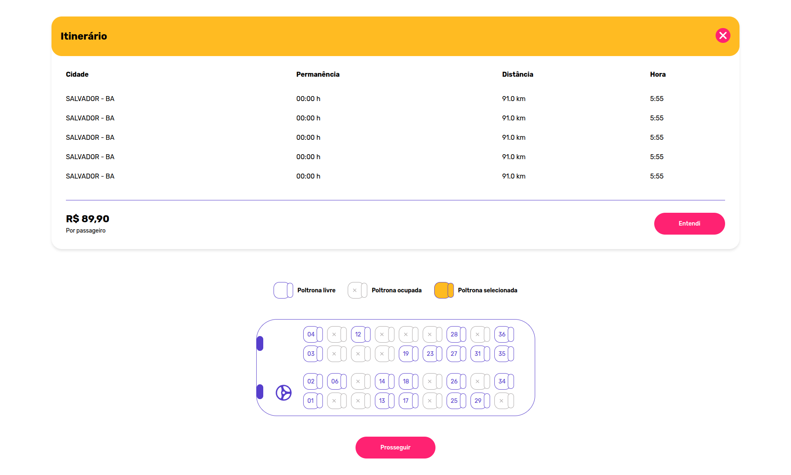
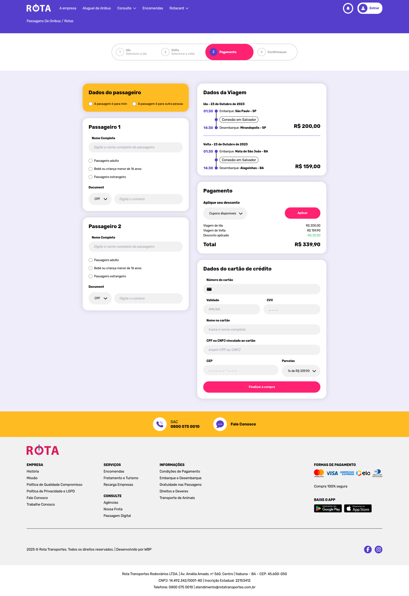
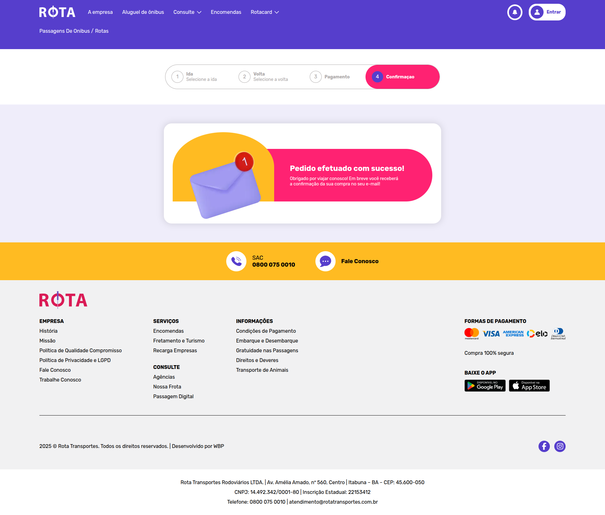
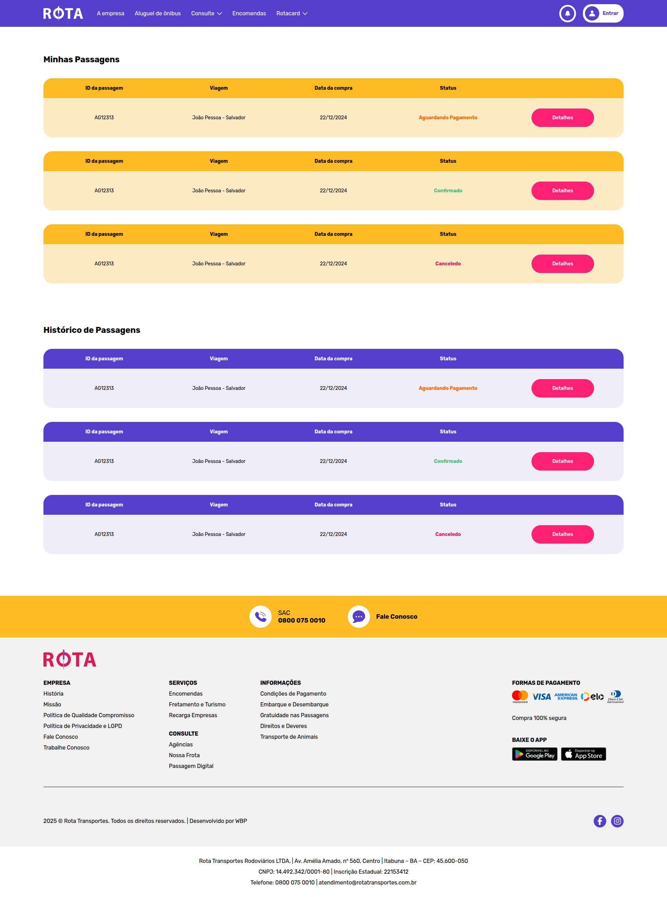

# 🚌 Sistema de Transporte Rodoviário

## 📱 Visão Geral do Sistema

Este é um sistema completo de transporte rodoviário que permite aos usuários comprar passagens de ônibus de forma digital, gerenciar suas viagens e acompanhar o status de suas reservas. O sistema oferece uma interface moderna e intuitiva para facilitar o processo de compra e gestão de passagens.

## 🏠 Página Inicial

### Tela Principal

A página inicial do sistema apresenta uma interface limpa e moderna, com destaque para as principais funcionalidades disponíveis para os usuários.

### Versões White Label
O sistema suporta personalização através de versões white label, permitindo adaptação para diferentes empresas de transporte:

## 🎫 Sistema de Compra de Passagens

### Passo 1: Seleção de Passagens

O primeiro passo do processo de compra permite aos usuários:
- Buscar rotas disponíveis
- Selecionar origem e destino
- Escolher datas de viagem
- Visualizar horários disponíveis

### Seleção de Itinerário e Poltrona

Nesta etapa, os usuários podem:
- Visualizar o layout do ônibus
- Selecionar poltronas disponíveis
- Ver informações detalhadas do itinerário
- Confirmar os detalhes da viagem

### Passo 3: Pagamento

O sistema de pagamento oferece:
- Múltiplas formas de pagamento
- Validação de dados do cartão
- Confirmação de valores

### Passo 4: Confirmação de Sucesso

Após o pagamento bem-sucedido, o usuário recebe:
- Confirmação da compra

## 📋 Gestão de Passagens

### Minhas Passagens

A área "Minhas Passagens" permite aos usuários:
- Visualizar todas as passagens compradas
- Acompanhar o status das viagens
- Cancelar ou alterar reservas
- Histórico de viagens

## 🚀 Funcionalidades Principais (Frontend)

- ✅ **Compra Online de Passagens**
- ✅ **Seleção de Poltronas**
- ✅ **Múltiplas Formas de Pagamento**
- ✅ **Gestão de Reservas**
- ✅ **Interface Responsiva**
- ✅ **Sistema White Label**

## 🛠️ Tecnologias Utilizadas

Next.JS 14
Typescript
Styled Components

Design System - Atomic Design

---

**Desenvolvido para modernizar o transporte rodoviário brasileiro**
